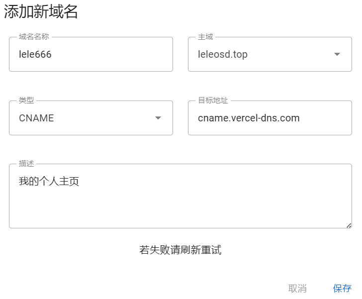
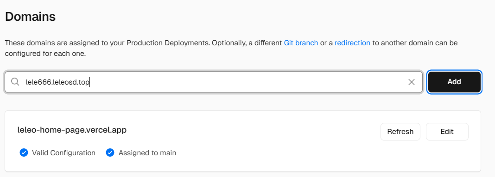
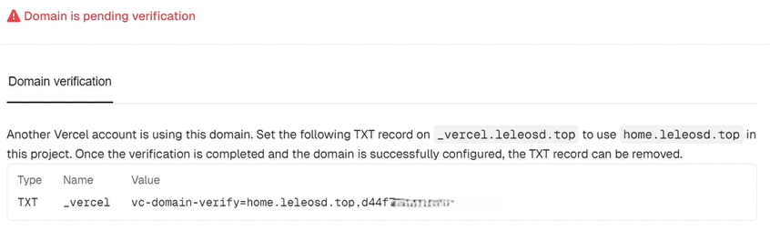
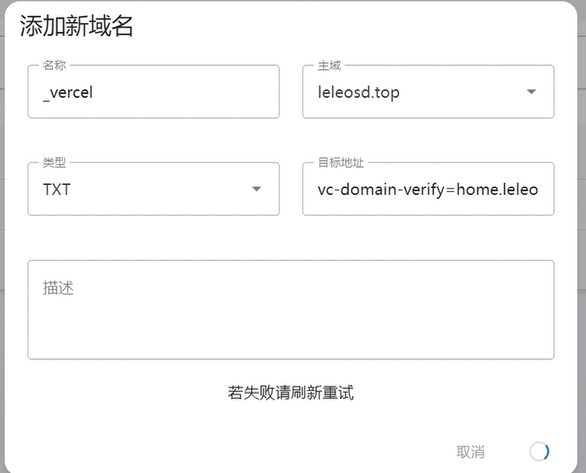
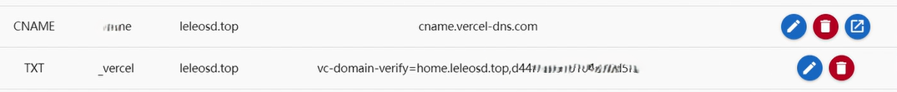
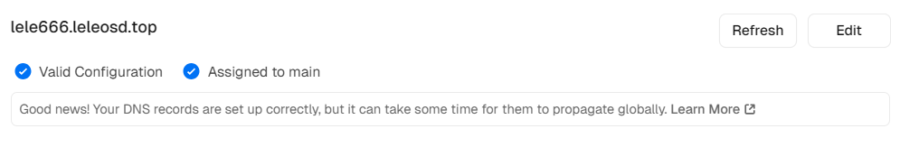

# 域名添加并CNAME解析到Vercel

## 1. 获取域名

## 2. 添加新域名（解析到vercel）
1. 进入"域名管理"页面
2. 点击"添加"按钮
3. 如下图输入信息（名称与描述随便，要求`类型`需选`CNAME`且`目标地址`需填`cname.vercel-dns.com`）。
4. 确认保存  

## 3. 在Vercel中配置
1. 登录[Vercel](https://vercel.com/)并进入项目控制台
2. 进入项目主界面
3. 在"Domains"部分添加上述解析的域名（将名称与主域拼接，例如 xxx.leleosd.top
  

4. 出现如下图所示的情况时(必定的，若无请等待验证):
  
复制其中的`Name`和`Value`的值，然后继续添加TXT记录：

5. 刷新等待Vercel验证域名所有权，完成后即可通过 xxxxxx.leleosd.top 来访问在vercel上部署的项目了。

## 注意事项
- DNS解析可能需要一点时间（一分钟左右），请耐心等待
- 如果解析不成功，请回到域名系统检查CNAME记录是否正确
